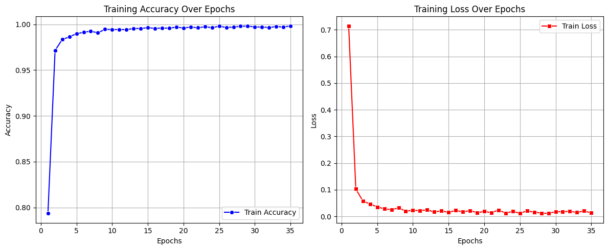

# Traffic Sign Classifier 🚦

A deep learning web application for classifying German traffic signs using TensorFlow and Flask. The application can identify 43 different types of traffic signs with high accuracy.


## 📋 Table of Contents

- [Features](#features)
- [Demo](#demo)
- [Project Structure](#project-structure)
- [Installation](#installation)
- [Usage](#usage)
- [API Documentation](#api-documentation)
- [Deployment](#deployment)
- [Configuration](#configuration)
- [Model Information](#model-information)
- [Contributing](#contributing)
- [License](#license)

## ✨ Features

- **Real-time Prediction**: Upload traffic sign images and get instant predictions
- **43 Traffic Sign Classes**: Recognizes 43 different German traffic signs
- **High Accuracy**: Trained on the German Traffic Sign Recognition Benchmark (GTSRB) dataset
- **Responsive UI**: Modern, mobile-friendly interface
- **RESTful API**: JSON API for easy integration
- **Health Monitoring**: Built-in health check endpoint
- **Docker Support**: Containerized deployment
- **Logging**: Comprehensive logging for debugging and monitoring
- **Production Ready**: Configured for deployment on Heroku, Railway, AWS, etc.

## 🧠 Model Information

## Metrics




## 🎥 Demo

The application provides a simple interface to:
1. Upload a traffic sign image (PNG, JPG, or JPEG)
2. View the prediction with confidence score
3. See the classified sign name

## 📁 Project Structure

```
Traffic_classifier/
├── app.py                  # Main Flask application with logging
├── config.py              # Configuration and environment variables
├── requirements.txt       # Python dependencies
├── Procfile              # Heroku/Railway deployment config
├── Dockerfile            # Docker configuration
├── docker-compose.yml    # Docker Compose configuration
├── runtime.txt           # Python version for deployment
├── .gitignore           # Git ignore rules
├── README.md            # This file
├── signname.csv         # Traffic sign class names
├── traffic-sign.h5      # Trained model (download separately)
│
├── static/              # Static files
│   ├── styles.css      # Application styles
│   └── uploads/        # Uploaded images (temporary)
│
├── templates/           # HTML templates
│   └── index.html      # Main page
│
├── scripts/            # Utility scripts
│   ├── sanitize_h5.py
│   └── patch_model_config.py
│
├── tests/              # Test images
│   ├── speed-limit-sign-30-km-h.jpg
│   └── traffic-arrow-sign-only-left.png
│
└── logs/              # Application logs
    └── app.log        # Main log file
```

## 🚀 Installation

### Prerequisites

- Python 3.10 or higher
- pip (Python package manager)
- Virtual environment (recommended)

### Local Setup

1. **Clone the repository**
```bash
git clone https://github.com/janeshnanda2005/Traffic_classifier.git
cd Traffic_classifier
```

2. **Create and activate virtual environment**
```bash
# Create virtual environment
python3 -m venv env

# Activate on Linux/Mac
source env/bin/activate

# Activate on Windows
env\Scripts\activate
```

3. **Install dependencies**
```bash
pip install -r requirements.txt
```

4. **Download the model**
   - Ensure `traffic-sign.h5` is in the project root
   - The model file is not included in git due to size (>100MB)

5. **Run the application**
```bash
python app.py
```

The application will be available at `http://localhost:5000`

## 💻 Usage

### Web Interface

1. Open your browser and navigate to `http://localhost:5000`
2. Click on the upload area or drag and drop a traffic sign image
3. Click "Classify Image"
4. View the prediction result with confidence score

### API Usage

#### Predict Endpoint

**POST** `/predict`

Upload an image file to get a prediction.

**Request:**
- Method: POST
- Content-Type: multipart/form-data
- Body: Form data with 'file' field containing the image

**Example using curl:**
```bash
curl -X POST -F "file=@path/to/traffic-sign.jpg" http://localhost:5000/predict
```

**Response:**
```json
{
  "success": true,
  "predicted_class": 1,
  "sign_name": "Speed limit (30km/h)",
  "confidence": 0.9876,
  "image_data": "base64_encoded_image...",
  "timestamp": "2025-11-08T10:30:45"
}
```

#### Health Check Endpoint

**GET** `/health`

Check the application health status.

**Response:**
```json
{
  "status": "healthy",
  "model_loaded": true,
  "csv_loaded": true,
  "timestamp": "2025-11-08T10:30:45"
}
```

### Environment Variables

| Variable | Default | Description |
|----------|---------|-------------|
| `FLASK_DEBUG` | `False` | Enable Flask debug mode |
| `PORT` | `5000` | Server port |
| `HOST` | `0.0.0.0` | Server host |
| `MODEL_PATH` | `traffic-sign.h5` | Path to model file |
| `SIGNNAME_CSV` | `signname.csv` | Path to sign names CSV |
| `UPLOAD_FOLDER` | `static/uploads` | Upload directory |
| `MAX_CONTENT_LENGTH` | `16777216` | Max upload size (16MB) |
| `LOG_LEVEL` | `INFO` | Logging level |
| `LOG_FILE` | `logs/app.log` | Log file path |
| `EAGER_LOAD_MODEL` | `False` | Load model at startup |
| `CORS_ENABLED` | `False` | Enable CORS |

### Example `.env` file

```env
FLASK_DEBUG=false
PORT=5000
LOG_LEVEL=INFO
EAGER_LOAD_MODEL=true
MODEL_PATH=traffic-sign.h5
```

## 🧠 Model Information

### Dataset: German Traffic Sign Recognition Benchmark (GTSRB)

- **Total Classes**: 43 traffic sign types
- **Training Images**: 34,799
- **Validation Images**: 4,410
- **Test Images**: 12,630
- **Image Size**: 32x32 pixels (RGB)

### Model Architecture

- Pre-trained model based on Convolutional Neural Networks
- Input shape: (32, 32, 3)
- Output: 43 classes with softmax activation
- Optimized for accuracy and inference speed

### Traffic Sign Classes

The model can identify 43 classes including:
- Speed limits (20, 30, 50, 60, 70, 80, 100, 120 km/h)
- No passing, No entry, Stop, Yield
- Priority road, Keep right/left
- Various warning signs (curves, bumps, animals, etc.)
- And more...

See `signname.csv` for the complete list.

## 🛠️ Development

### Running in Development Mode

```bash
export FLASK_DEBUG=true
export LOG_LEVEL=DEBUG
python app.py
```

### Running Tests

```bash
# Test with sample images
python -c "
from app import process_image
from PIL import Image

# Test prediction
with open('tests/speed-limit-sign-30-km-h.jpg', 'rb') as f:
    result = process_image(f)
    print(result)
"
```

### Code Structure

- `app.py`: Main Flask application with routes and error handlers
- `config.py`: Configuration management
- `templates/index.html`: Frontend UI
- `static/styles.css`: Responsive CSS styling

## 📊 Logging

The application uses Python's `logging` module with:
- Console output for development
- File logging to `logs/app.log`
- Configurable log levels (DEBUG, INFO, WARNING, ERROR)
- Structured log format with timestamps

View logs:
```bash
tail -f logs/app.log
```

## 🔒 Security Considerations

- File type validation (only PNG, JPG, JPEG allowed)
- File size limits (16MB max)
- Input sanitization
- Error handling without exposing sensitive information
- CORS configuration for production

## 🤝 Contributing

Contributions are welcome! Please feel free to submit a Pull Request.

1. Fork the repository
2. Create your feature branch (`git checkout -b feature/AmazingFeature`)
3. Commit your changes (`git commit -m 'Add some AmazingFeature'`)
4. Push to the branch (`git push origin feature/AmazingFeature`)
5. Open a Pull Request

## 📝 License

This project is licensed under the MIT License - see the LICENSE file for details.

## 👥 Authors

- **Janesh Nanda** - [janeshnanda2005](https://github.com/janeshnanda2005)

## 🙏 Acknowledgments

- German Traffic Sign Recognition Benchmark (GTSRB) dataset
- TensorFlow and Keras teams
- Flask framework contributors

## 📞 Support

For issues and questions:
- Create an issue on GitHub
- Contact: [janeshnanda@gmail.com]

---

Made with ❤️ using Flask and TensorFlow
